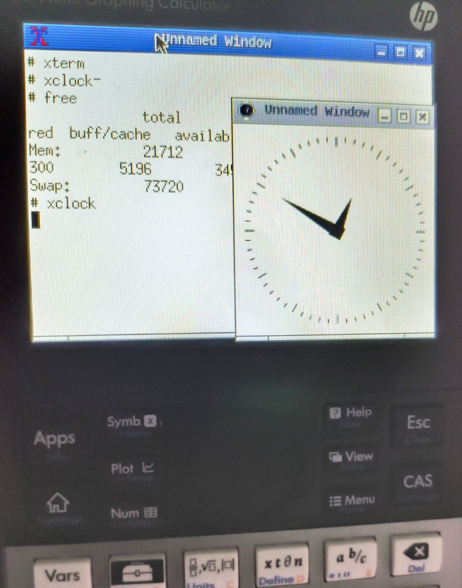
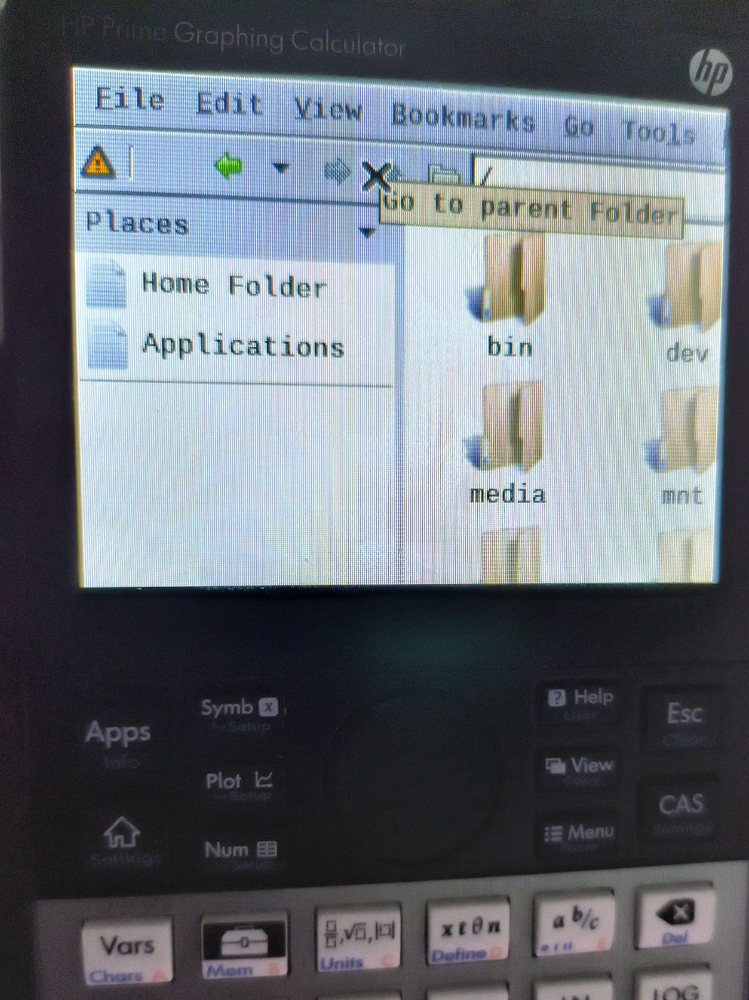

# Linux for HP Prime V2 (G1)

# What's working
- [x] Nand Flash (No ECC)
- [x] I2C Touchscreen (GT9137)
- [x] Keypad
- [x] USB Host 1.1
- [x] USB Devide 2.0
- [x] DRM Support (for X11/SDL)





# Build Step

## STEP 1
1) Build Bootloader `BOOT1.ROM` from <a>https://github.com/Repeerc/hpprimev2_linux_loader


2) Build Kernel `zImage` from <a>https://github.com/Repeerc/Kernel-6.1.35-HP-Prime-V2_G1


3) Build RootFS `rootfs.jffs2` from <a>https://github.com/Repeerc/buildroot_hpprimev2

## STEP 2
Make `LINUX.DAT` by using `mkimg.sh`

## STEP 3
Flash `BOOT1.ROM` and `LINUX.DAT`.

By using `usbtool.exe`, connect calculator in Recovery Mode (`RESET` + `Symb`) , select `Auto update` then click `Update` .

# Bugs:

1) NAND Flash Host ECC is not work.

2) Could not reboot or poweroff when enable USB Gadget.

3) Kernel panic when disable USB Gadget.

4) USB HOST Mode not work when enable USB Gadget.


# Flash Layout

nand: Hynix H27U2G8F2CTR-BC

nand: 256 MiB, SLC, erase size: 128 KiB, page size: 2048, OOB size: 64

2048 Block Total.


Block 0~1: `BXCBOOT0.BIN` HP BOOT Code (Recovery Mode Included)

Block 2...9: `BOOT1.rom`

Block 10...x : Kernel `zImage` 

Block 64...y : Rootfs `rootfs.jffs2` 

Block y...2040 : Arbitrary Data (data,swap etc.)

Block 2047: Serial Number and other original system information


When `BOOT1.ROM` boot, block 0-9 and 2040-2047 will be set to protected in case, so it can be flashed back to the original system.


It seems that `usbtool.exe` could not access over 64MB flash space, so `Kernel + Rootfs` were limited in 64MB.

# GPIO

### USB OTG:

GPH14 = 238 = USBD_PLL ?

GPH13 = 237 = 5V_USB_BOOST_EN

GPF7 = 167 = 5V_USB_OUT_EN

GPF5 = Extern USB Power INSERT ? 

GPF6 = OTG ID ?

### Touch:

GPF2 = TS_INT

GPF0 = TS_RST

### Enable USB Power Output

```bash
echo 237 > /sys/class/gpio/export
echo out > /sys/class/gpio/gpio237/direction
echo 1 > /sys/class/gpio/gpio237/value

echo 167 > /sys/class/gpio/export
echo out > /sys/class/gpio/gpio167/direction
echo 1 > /sys/class/gpio/gpio167/value
```

